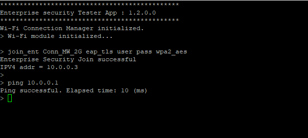

# Enterprise Security Tester App

This application provides a console interface to test enterprise Wi-Fi commands. This application integrates the command console library.

See the command console library [Readme.md](https://github.com/Infineon/command-console/blob/master/README.md) for more information.

## Requirements

- [ModusToolbox&trade; software](https://www.infineon.com/modustoolbox) v3.2 or later (tested with v3.2) with ModusToolbox&trade;
- Programming language: C
- Associated parts: [CYW955913EVK-01 Wi-Fi Bluetooth&reg; Prototyping Kit](https://www.infineon.com/CYW955913EVK-01)

## Supported EAP Security protocols
* EAP TLS
* PEAPv0 with MSCHAPv2

## Supported Enterprise Security Modes
* WPA
* WPA2
* WPA3 Transition
* WPA3 Enterprise only
* WPA3 192Bit

## Supported toolchains (make variable 'TOOLCHAIN')

- GNU Arm&reg; embedded compiler v11.3.1 (`GCC_ARM`) - Default value of `TOOLCHAIN`


## Supported kits (make variable 'TARGET')
- CYW955913EVK-01 Wi-Fi Bluetooth&reg; prototyping kit (`CYW955913EVK-01`) – Default value of `TARGET`

## Hardware setup

This example uses the kit’s default configuration. See the respective kit guide to ensure that the kit is configured correctly.

## Software setup

1. Install a terminal emulator if you don't have one. Instructions in this document use [Tera Term](https://teratermproject.github.io/index-en.html).

2. Install a Python interpreter if you don't have one. This code example is tested using [Python 3.7.5](https://www.python.org/downloads/release/python-375/).

## Prerequisite

The test setup shall consist of 3 components
* Client : Kit
* Authenticator : Enterprise Wi-Fi Access Point
* Authentication server : Radius server (Example, FreeRadius).

**Enterprise Setup**


The kit will connect to the Wi-Fi Access point using the keys and certificates defined in `certificate.h`. User shall update the `certificate.h` with proper key and certificates.

**Note**:  WPA3 192Bit command will be using the macros WPA3_192BIT_ROOT_CERTIFICATE_STRING, WPA3_192BIT_USER_PRIVATE_KEY_STRING, WPA3_192BIT_USER_CERTIFICATE_STRING in `certificate.h` for connection.

### Generating test certificates
This section describes the method to generate the keys and sertificate using `openssl` for testing. If the testing is carried out in actual enterprise network, this step is not needed as the device key and certificates will be provided by the network administrator.

1. Generate Root Key `rootKey.pem`.
    ```
    openssl ecparam -name prime256v1 -genkey -noout -out rootKey.pem
    ```
2. Generate Root Certificate: This shall be updated in `WIFI_ROOT_CERTIFICATE_STRING`/ `WPA3_192BIT_ROOT_CERTIFICATE_STRING`. Also update the root certificate in radius server.
    ```
    openssl req -new -key rootKey.pem -x509 -nodes -days 365 -out rootCert.pem
    ```
    This command will prompt for necessary information like country code, State etc.

3. Generate Client Key and certificate. `ClientKey.pem` shall be updated in `WIFI_USER_PRIVATE_KEY_STRING` / `WPA3_192BIT_USER_PRIVATE_KEY_STRING`. client.crt shall be updated in `WIFI_USER_CERTIFICATE_STRING` / `WPA3_192BIT_USER_CERTIFICATE_STRING`.
    1. Create Client Key `ClientKey.pem`:
    ```
    openssl ecparam -name prime256v1 -genkey -noout -out clientKey.pem
    ```

    2. Create CSR :
    ```
    openssl req -new -sha256 -key clientKey.pem -out client.csr
    ```

    3. Create Client Certificate `client.crt`:
    ```
    openssl x509 -req -days 365 -in client.csr -CA rootCert.pem -CAkey rootKey.pem -CAcreateserial -out client.crt
    ```
4. Generate Server Key and certificate. These shall be loaded in radius server.
    1. Create Server Key `serverKey.pem`:
    ```
    openssl ecparam -name prime256v1 -genkey -noout -out serverKey.pem
    ```

    2. Create CSR :
    ```
    openssl req -new -sha256 -key serverKey.pem -out server.csr
    ```

    3. Create Server Certificate `server.crt`:
    ```
    openssl x509 -req -days 365 -in server.csr -CA rootCert.pem -CAkey rootKey.pem -CAcreateserial -out server.crt
    ```

## Using the code example

Create the project and open it using one of the following:

<details><summary><b>In Eclipse IDE for ModusToolbox&trade; software</b></summary>

1. Click the **New Application** link in the **Quick Panel** (or, use **File** > **New** > **ModusToolbox&trade; Application**). This launches the [Project Creator](https://www.infineon.com/ModusToolboxProjectCreator) tool.

2. Pick a kit supported by the code example from the list shown in the **Project Creator - Choose Board Support Package (BSP)** dialog.

   When you select a supported kit, the example is reconfigured automatically to work with the kit. To work with a different supported kit later, use the [Library Manager](https://www.infineon.com/ModusToolboxLibraryManager) to choose the BSP for the supported kit. You can use the Library Manager to select or update the BSP and firmware libraries used in this application. To access the Library Manager, click the link from the **Quick Panel**.

   You can also just start the application creation process again and select a different kit.

   If you want to use the application for a kit not listed here, you may need to update the source files. If the kit does not have the required resources, the application may not work.

3. In the **Project Creator - Select Application** dialog, choose the example by enabling the checkbox.

4. (Optional) Change the suggested **New Application Name**.

5. The **Application(s) Root Path** defaults to the Eclipse workspace which is usually the desired location for the application. If you want to store the application in a different location, you can change the *Application(s) Root Path* value. Applications that share libraries should be in the same root path.

6. Click **Create** to complete the application creation process.

For more details, see the [Eclipse IDE for ModusToolbox&trade; software user guide](https://www.infineon.com/MTBEclipseIDEUserGuide) (locally available at *{ModusToolbox&trade; software install directory}/docs_{version}/mt_ide_user_guide.pdf*).

</details>

<details><summary><b>In command-line interface (CLI)</b></summary>

ModusToolbox&trade; software provides the Project Creator as both a GUI tool and the command line tool, "project-creator-cli". The CLI tool can be used to create applications from a CLI terminal or from within batch files or shell scripts. This tool is available in the *{ModusToolbox&trade; software install directory}/tools_{version}/project-creator/* directory.

Use a CLI terminal to invoke the "project-creator-cli" tool. On Windows, use the command line "modus-shell" program provided in the ModusToolbox&trade; software installation instead of a standard Windows command-line application. This shell provides access to all ModusToolbox&trade; software tools. You can access it by typing `modus-shell` in the search box in the Windows menu. In Linux and macOS, you can use any terminal application.

The "project-creator-cli" tool has the following arguments:

Argument | Description | Required/optional
---------|-------------|-----------
`--board-id` | Defined in the `<id>` field of the [BSP](https://github.com/Infineon?q=bsp-manifest&type=&language=&sort=) manifest | Required
`--app-id`   | Defined in the `<id>` field of the [CE](https://github.com/Infineon?q=ce-manifest&type=&language=&sort=) manifest | Required
`--target-dir`| Specify the directory in which the application is to be created if you prefer not to use the default current working directory | Optional
`--user-app-name`| Specify the name of the application if you prefer to have a name other than the example's default name | Optional

<br />

The following example clones the "mtb-threadx-enterprise-security-tester" application with the desired name "enterprise-tester" configured for the *CYW955913EVK-01* BSP into the specified working directory, *C:/mtb_projects*:

   ```
   project-creator-cli --board-id CYW955913EVK-01 --board-id CYW955913EVK-01 --app-id mtb-threadx-enterprise-security-tester --user-app-name enterprise-tester --target-dir "C:/mtb_projects"
   ```

**Note:** The project-creator-cli tool uses the `git clone` and `make getlibs` commands to fetch the repository and import the required libraries. For details, see the "Project creator tools" section of the [ModusToolbox&trade; software user guide](https://www.infineon.com/ModusToolboxUserGuide) (locally available at *{ModusToolbox&trade; software install directory}/docs_{version}/mtb_user_guide.pdf*).
<br />

</details>

<details><summary><b>In third-party IDEs</b></summary>

Use one of the following options:

- **Use the standalone [Project Creator](https://www.infineon.com/ModusToolboxProjectCreator) tool:**

   1. Launch Project Creator from the Windows Start menu or from *{ModusToolbox&trade; software install directory}/tools_{version}/project-creator/project-creator.exe*.

   2. In the initial **Choose Board Support Package** screen, select the BSP, and click **Next**.

   3. In the **Select Application** screen, select the appropriate IDE from the **Target IDE** drop-down menu.

   4. Click **Create** and follow the instructions printed in the bottom pane to import or open the exported project in the respective IDE.

<br />

- **Use command-line interface (CLI):**

   1. Follow the instructions from the **In command-line interface (CLI)** section to create the application.

   2. Export the application to a supported IDE using the `make <ide>` command.

   3. Follow the instructions displayed in the terminal to create or import the application as an IDE project.

For a list of supported IDEs and more details, see the "Exporting to IDEs" section of the [ModusToolbox&trade; software user guide](https://www.infineon.com/ModusToolboxUserGuide) (locally available at *{ModusToolbox&trade; software install directory}/docs_{version}/mtb_user_guide.pdf*).

</details>

## Commands

1. Enterprise commands:
    1. **join_ent** : This command will connect the device to enterprise Wi-Fi network.

    ```
    join_ent <ssid> <eap_protocol> [username] [password] [eap] <wifi auth_type>
    ```
    Example:
    ```
    join_ent WIFI_SSID eap_tls user pass eap wpa2_aes
    ```

    **Enterprise Join Example**

   

    **Note1**: WPA3 Enterprise command auth types :
    * `wpa3_aes_ccmp`: WPA3 Transition mode
    * `wpa3_aes_gcm`:  WPA3 Enterprise only mode
    * `wpa3_192bit`:   WPA3-Enterprise 192-bit mode

    **Note2**: EAP security protocols :
    * `eap_tls`: EAP TLS
    * `peap`   : PEAPv0 with MSCHAPv2

    2. **leave_ent** : Leave from the connected enterprise Wi-Fi network.

2. Data transfer commands:
    1. **start_echo_server** : This command will start a TCP echo server with the given port number. The server will echo back the data received from the client.
    ```
    start_echo_server <tcp_port_number>
    ```
    Example:
    ```
    start_echo_server 50007
    ```
    2. **stop_echo_server** :Stops the TCP echo server.
    3. **connect_to_server** : This will create a secure connection to the remote server using the remote ip address and port number. The keys and ceriticates are taken from `ent_secure_tcp_client.h`. The device will send and 'ACK' back to any data received from remote side.

    ```
    connect_to_server <IP Address> <tcp_port_number>
    ```
    Example:
    ```
    connect_to_server 10.0.0.3 50007
    ```
    4. **disconnect_server** : Disconnects the existing secure connection.


## Operation

1. Connect the board to your PC using the provided USB cable through the KitProg3 USB connector.
2. Open a terminal program and select the KitProg3 COM port. Set the serial port parameters to 8N1 and 115200 baud.
3. Program using one of the following and reset the board:

   <details><summary><b>Using Eclipse IDE for ModusToolbox&trade; software</b></summary>

      1. Select the application project in the Project Explorer.

      2. In the **Quick Panel**, scroll down, and click **\<Application Name> Program**.
   </details>

   <details><summary><b>Using CLI</b></summary>

     From the terminal, execute the `make program` command to build and program the application using the default toolchain to the default target. The default toolchain and target are specified in the application's Makefile but you can override those values manually:
      ```
      make program TARGET=APP_<BSP> TOOLCHAIN=<toolchain>
      ```

      Example:
      ```
      make program TARGET=APP_CYW955913EVK-01 TOOLCHAIN=GCC_ARM
      ```
   </details>
4. Connect to enterprise Wi-Fi AP using **join_ent**.
5. Testing Data Path
    1. Start TCP echo server using **start_echo_server** with port number.
    2. Note down the IP address displayed in Step-4.
    2. Connect your PC to the Wi-Fi AP.
    3. From the scripts directory, open a command shell and run the Python TCP client (*client.py*). In the command shell opened in the scripts directory, type in the following command:
    ```
      python client.py <IP address> <Port Number>
    ```
    For Example, if the IP address of the device is "192.168.1.125" and the port number is "50007", the command will be
    ```
      python client.py 192.168.1.125 50007
    ```

    **Data Path Test Example**
   

    Note: The python script will wait for the input on the console and will send to the device after connection. To terminate the data transfer, type **exit**

**Note** : This code example has been tested with `Aruba AP 635` for WPA2 Enterprise security and WPA3 Enterprise 192Bit. The WPA3 Enterprise only and transition modes are validated using hostapd (v2.10) as Access Point due to limiations in Aruba AP.


## Document history

Document title: Enterprise Security Tester App

| Version | Description of change |
| ------- | --------------------- |
| 1.1.0   | Added PEAP commands   |
| 1.0.0   | Initial version with EAP TLS support. |
